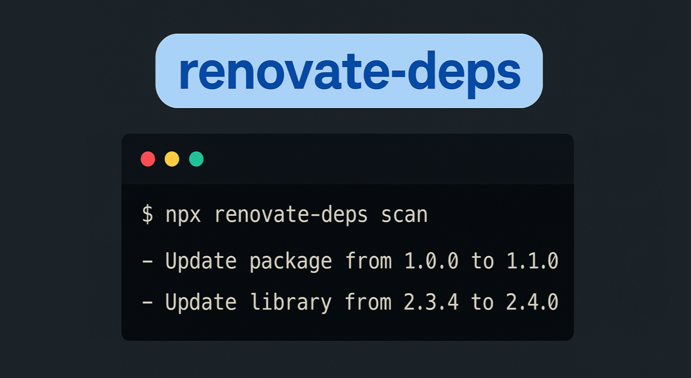

<p align="center">
  
</p>

# Overview

`renovate-deps` is a CLI tool that helps provide an overview of the different pending Renovate dependency updates across multiple repositories. It works by scanning [Renovate dependency dashboards](https://docs.renovatebot.com/key-concepts/dashboard/), so it won’t list updates that are not included in the dependency dashboard (e.g., if certain updates have been disabled in the Renovate config). The results will only ever be as up to date as the dependency dashboards themselves.

You can run the CLI directly using `npx`:

```sh
npx renovate-deps <command>
```

To see a list of available commands, run:

```sh
npx renovate-deps --help
```

# Commands

## `init`

Setup and authenticate the CLI so it can pull data from your repositories.

```sh
npx renovate-deps init
```

## `repo-groups`

Manage your repository groups for dependency analysis.

Using repository groups can help speed up dependency analysis since the CLI won't have to pull the list of repositories it needs to work with before each scan.

This can also be a great option to use if your organization has a lot of repositories but you only care about a specific subset of repositories.

The downside of using repository groups is that you might not be made aware of new repositories added to your organization since the repository group was created.

### Create a repository group

```sh
npx renovate-deps repo-groups create <groupName> [--repos owner/repo1 owner/repo2] [--force] [--verbose]
```

Options:

- `-r, --repos` → List of repositories to add to the group
- `-f, --force` → Overwrite existing group
- `--verbose` → Show debug info

### Delete a repository group

```sh
npx renovate-deps repo-groups delete <groupName>
```

### List all repository groups

```sh
npx renovate-deps repo-groups list
```

### Scan a repository group for pending updates

```sh
npx renovate-deps repo-groups scan <groupName> [--dependencies dependency1 dependency2] [--updateType major|minor|patch] [--verbose]
```

#### Options:

- `-d, --dependencies` → Filter updates by specific dependencies
- `--ut, --update-type` → Filter updates by update type. Can be one of 'major', 'minor' or 'patch'
- `-q, --quiet` → Only print repositories with pending updates. Useful when scanning many repositories with very specific filters.
- `--verbose` → Show debug info

## `scan`

List pending dependency updates for repositories that the CLI has access to using GitHub's [list repositories API](https://octokit.github.io/rest.js/v21/#repos-list-for-authenticated-user) and that match the specified filters.

```sh
npx renovate-deps scan [--repos owner/repo1] [--owner owner-name] [--dependencies dependency1 dependency2] [--updateType major|minor|patch] [--verbose]
```

#### Options:

- `-r, --repos` → List of repositories to scan (mutually exclusive with `--owner`)
- `-o, --owner` → Scan all repositories for a specific owner (mutually exclusive with `--repos`)
- `-d, --dependencies` → Filter updates by dependencies
- `--ut, --update-type` → Filter updates by update type. Can be one of 'major', 'minor' or 'patch'
- `-q, --quiet` → Only print repositories with pending updates. Useful when scanning many repositories with very specific filters.
- `--verbose` → Show debug info

#### Example Usage:

```sh
npx renovate-deps scan -r my-org/my-repo my-org/another-repo
npx renovate-deps scan -o my-org
npx renovate-deps scan -d dependency1 dependency2
npx renovate-deps scan -r my-org/my-repo -d dependency1 dependency2
```

## `list-repos`

Display the repositories accessible to the authenticated user GitHub's [list repositories API](https://octokit.github.io/rest.js/v21/#repos-list-for-authenticated-user). These are the repositories will be scanned by the CLI using the `scan` command.

This command can also help determine which repositories to include in [repository groups](#repo-groups), or simply debug that you have access to the correct repositories.

```sh
npx renovate-deps list-repos [--verbose]
```

#### Options:

- `--verbose` → Show debug info

## `cleanup`

Remove all persisted configuration used by the CLI from your machine.

Useful to run if you want to uninstall the CLI and make sure no configuration files and data is left behind.

```sh
npx renovate-deps cleanup
```
